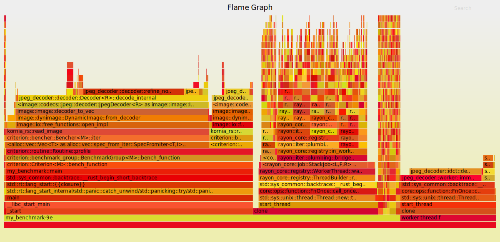

# kornia_io

## (🚨 Warning: Unstable Prototype 🚨)

Repository in kornia for video streaming, reading and writing images.

# For testing rust code

`cargo test --release  -- --nocapture`

For run tests in release mode printing values

`cargo bench`

For running benchmarking test

## Useful links

- https://www.reddit.com/r/rust/comments/k1wjix/why_opening_of_images_is_so_slow/
- https://github.com/flamegraph-rs/flamegraph
- https://github.com/Canop/glassbench?ref=rustrepo.com

## Cargo flamegraph

Install flamegraph and activate perf (remove after be used)

`echo -1 | sudo tee /proc/sys/kernel/perf_event_paranoid`

